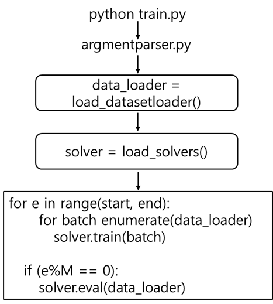

# DSTorch
This project is to build a lightweight, PyTorch-based neural network training platform. Existing platforms like PyTorch Lightning or MMDetection are becoming heavier and more complex over time. To address this issue, DSTorch is designed so that it contains only source files, each dedicated to one of: dataset, optimization, model, parameters, train/eval, and loss. Even though the source files are well connected to make train.py runnable, you must define your own model, dataset, parameters, optimizer, and loss for the task at hand. This will give you the freedom to think creatively and work flexibly, even though it sometimes gets your hands dirty.

# Code Structure : How it works?

It starts training by running

```
python train.py --exp_id 0 --gpu_num 0
```

The image below illustrates the overall architecture of this platform.

<div align="center">
  
</div>


When it starts training, it automatically reads parameters pre-defined in *argumentparser.py* and json files in **config**. The parameters can be used to define your NNs and other training and evaluation related settings. I recommend that *argumentparser.py* is used to control parameters that are often changed over multiple trainings such as **batch size**, **the number of epochs**, etc. Whereas, the json files are used to define parameters that don't change frequently over multiple trainings. This platform comprises three parts:

## (1) Dataset Loader

**load_datasetloader()** defined in *helper.py* returns pytorch dataset loaders. You need to define your own dataset like I did in *./dataset/NuscenesDataset/loader_2d_obj_det.py* The recalled loaders are then used for training and evaluation. 

## (2) Solver

**load_solver()** defined in *helper.py* returns a class defined in *./optimization/projectname_solver.py*. You need to define your own solver class like I did in *./optimization/Yolo_solver.py* The recalled solver is then used to train a model and evaluate it. The solver class should have features like

  * declare a model to be trained
  * declare an optimizer and a learning rate scheduler to train the model
  * declare loss functions
  * train and evaluate the model
  * print traning and evaluation progress
  * etc

## (3) Model

You should define your own model in *./models/* like I did in *./models/Yolo/yolo.py*. The model class defined in, for example, *./models/Yolo/yolo.py* is called in the solver class.